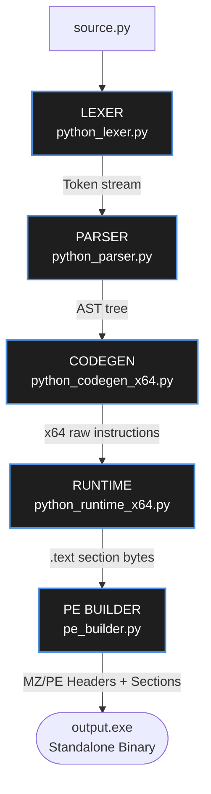
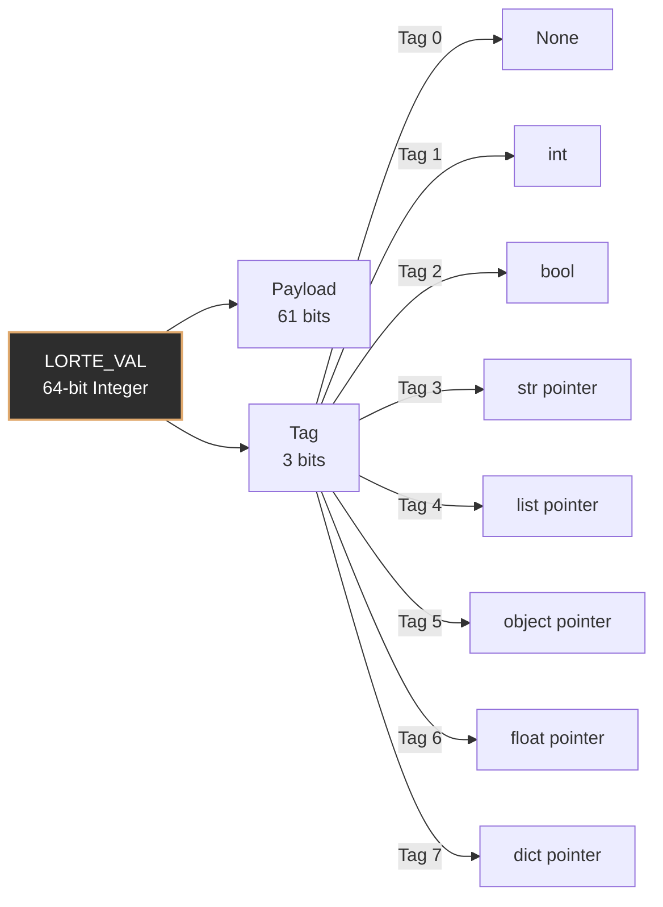
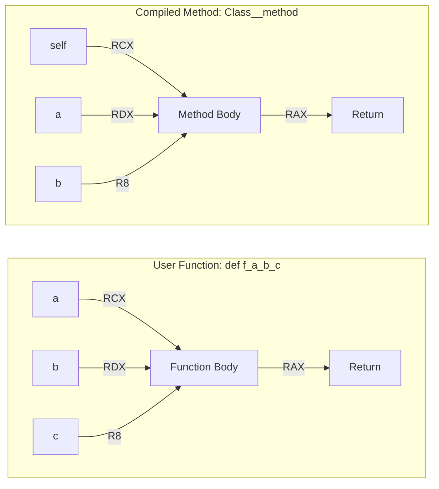
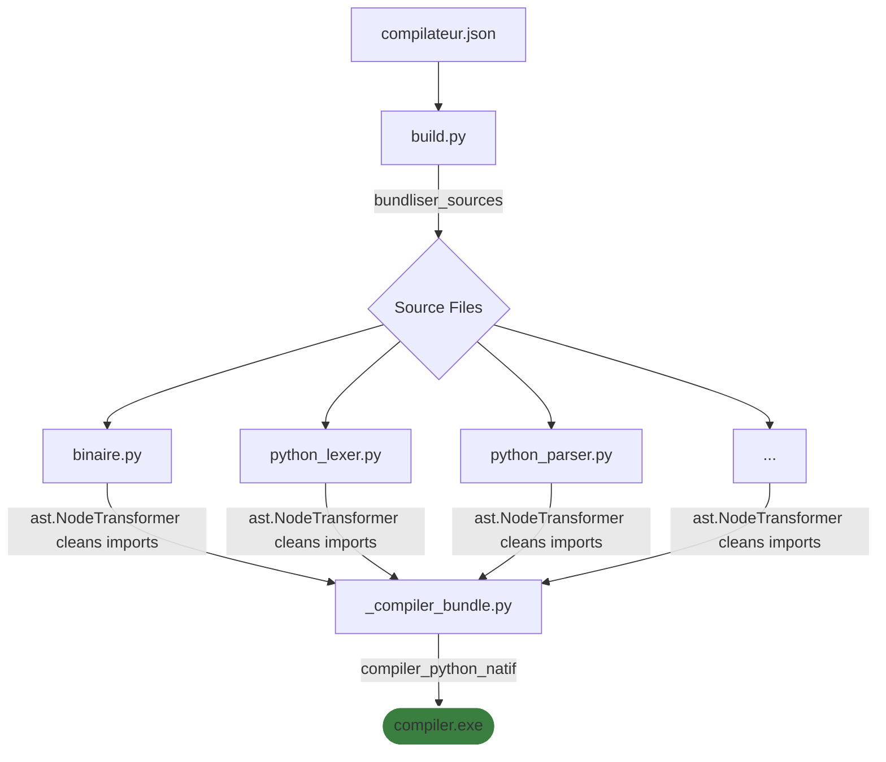
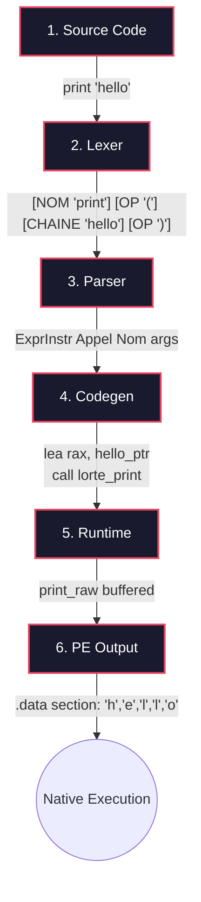
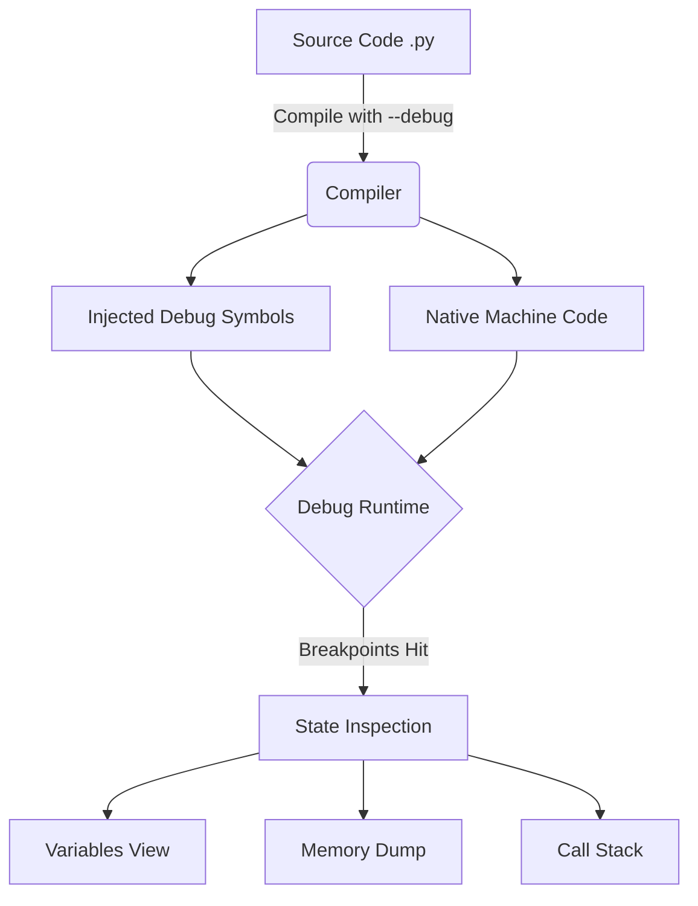

**This project is currently under active development.**

A beta version is coming out; I'm updating the GitHub.

#  Python Compiler

<p align="center">
  
</p>

A native, ahead-of-time (AOT) Python compiler written completely from scratch. 

This tool compiles pure Python code directly into standalone, native machine code (binary) for x86 and x64 architectures. Unlike existing solutions, it completely bypasses any intermediate C generation or heavy interpreter packaging.

##  Deep Dive: The Compiler Architecture & Philosophy

The compiler is engineered from the ground up to bridge the massive gap between Python's high-level, dynamic execution model and the raw, unyielding performance of native machine code. Most attempts at compiling Python rely on either packing a heavy interpreter with the scripts (like PyInstaller) or transpiling Python into C code as an intermediate step (like Nuitka). This project takes the hardest, but most performant route: **Direct Native Compilation**.

### 1. The Core Engineering Challenge
Python is dynamically typed; variables don't have types, only values do. A simple expression like `a + b` could mean integer addition, string concatenation, or a custom class operator. A standard interpreter determines this at runtime on every single execution, which is slow. Our compiler resolves this by generating specialized polymorphic machine code instructions. It creates native pathways that check the data types (using our ultra-fast `LORTE_VAL` system) in a few CPU cycles and instantly branches to the correct low-level logic (e.g., `ADD RAX, RBX`).

### 2. Zero-Dependency Standalone Binaries
When we say "no dependencies", we mean it. The compiler parses the abstract syntax tree (AST) of your Python code and maps every single Python instruction directly to x86/x64 assembly instructions. 
It then manually structures the Windows PE32/PE64 (Portable Executable) headers, allocates the `.text` (code), `.data` (initialized data like strings), and `.rdata` sections, and writes the raw binary bytes to the disk. The resulting `.exe` doesn't need `python39.dll`, it doesn't need a C++ redistributable, and it doesn't need the user to install Python. It is purely the CPU talking directly to the operating system's kernel.

### 3. The Embedded Micro-Runtime
To make Python work natively, the compiler injects a highly optimized, microscopic runtime written directly in assembly. This micro-runtime is bound into the final executable. It handles:
*   **Memory Allocation**: A custom, lightning-fast heap allocator that replaces Python's traditional `malloc` wrappers.
*   **Built-in Types**: Native implementations of lists, dictionaries, strings, and floats using raw memory blocks and pointers, bypassing all standard Python overhead.
*   **String Manipulation**: Direct UTF-8 byte manipulation in memory for hyper-fast string slicing and concatenation.

### 4. Bypassing the Abstract Syntax Tree (AST) Bottlenecks
During compilation, the Lexer and Parser read the `.py` files and generate an AST. However, instead of passing this AST to an evaluation loop, our Code Generation engine walks the AST exactly once at compile-time. It translates complex loops (`for`, `while`) into direct native jumps (`JMP`, `JNE`, `JZ`) and variable assignments into direct memory offsets relative to the base pointer (`RBP - 8`). This means the structural logic of your code is permanently baked into the CPU's execution path.

By merging these concepts, the compiler achieves maximum hardware execution speed, bypassing all intermediate interpretation steps.

---

## How It Works — Compilation Pipeline

The compiler transforms a `.py` source file into a native `.exe` in **6 stages**. Each stage is a distinct module with a clear responsibility.



---

## The LORTE_VAL Type System

All Python values at runtime are represented as a single 64-bit integer called a **LORTE_VAL**. The 3 lowest bits are a **tag** that identifies the type. The remaining 61 bits carry the payload.



This encoding means type checks are a single `AND rax, 7` instruction, and integer arithmetic only requires a shift. No boxing overhead for integers.

---

## Calling Convention

The compiler uses the **Windows x64 ABI** (Microsoft calling convention) throughout — both for calls into the runtime and for user-defined functions.



---

## Multi-File Bundling (project.json)

When a project has multiple source files, the build system **bundles** them before compilation:



---

## Concrete Example: `print("hello")`

Here is what happens at each stage for the single instruction `print("hello")`:



---

## Technical Approach

Most Python packagers or compilers take one of two routes:
* **Interpreter Bundling:** Packaging CPython and dependencies into an archive (e.g., PyInstaller).
* **C Transpilation:** Translating Python code into C source code before compiling it (e.g., Nuitka).

**Python Compiler takes a direct route:** It parses the Python abstract logic and writes raw machine code instructions (binary octets) directly into the executable file. 

For example, when the compiler encounters a `print("hello world")` statement, it does not convert it to a C `printf`. Instead, it immediately maps the statement to the exact processor-level system calls required to output the text to the screen.

---

## Key Features

* **Direct Binary Generation:** Bypasses C generation to output raw machine code.
* **Zero Dependencies:** Outputs a single, lightweight, standalone executable.
* **Project Configuration:** Supports multi-file compilation using a structured JSON configuration file.
* **Architecture Targeting:** Capability to target x86 (32-bit) and x64 (64-bit) architectures.

---

## Project Status

**Warning:** This project is currently under active development. 

Because it targets machine code directly, building complete coverage for the entire Python ecosystem is a monumental task. As of now, heavy third-party libraries (such as PyQt, NumPy, etc.) are not yet integrated or supported. The focus is currently on stabilizing core Python syntax, built-in types, control flows, and file structures.

---

##  Debug Mode

The compiler includes a powerful built-in **Debug Mode** that allows developers to inspect the state of their program at runtime, right at the machine code level but with high-level Python context.

<p align="center">
  
</p>

When compiling with the debug flag, the compiler injects specialized tracking instructions alongside the standard machine code. This creates a continuous bridge between the executing binary and the original Python source.

### Debug Architecture Schema



**Key Debug Features:**
*   **Variable Tracking**: Inspect local and global variables mapped from memory addresses back to Python objects using the `LORTE_VAL` type system.
*   **Call Stack Analysis**: Trace function calls with exact line numbers corresponding to the original `.py` source.
*   **Memory Inspection**: Directly view the heap structure of complex objects like lists and dictionaries to identify memory leaks or corruption.
*   **Breakpoint Handling**: Set breakpoints directly on Python source lines, which are mapped to the corresponding `INT 3` (0xCC) software breakpoints in the resulting binary.

---

##  Configuration File Example

For multi-file projects, you can manage the build architecture and source files using a `compiler.json` configuration file:

```json
{
  "project_name": "MyProject",
  "version": "1.0.0",
  "main_entry": "main.py",
  "source_files": [
    "modules/logic.py",
    "modules/utils.py"
  ],
  "target_architecture": "x64",
  "output_directory": "build/"
}
```
---

## Speed Test: Compiled vs Uncompiled Python

Below is a benchmark performance test highlighting the massive speed difference between standard interpreted Python and the binary executable generated by this compiler.

### 1. Compiled Execution (Native Binary)
The following image shows the execution time of the code after being compiled into a native binary:


---

### 2. Uncompiled Execution (Standard Python)
The following image shows the execution time of the exact same script running through the standard standard CPython interpreter:


---

### Benchmark Analysis

The results show a massive difference of **14.5844588186646 seconds** in favor of the compiled version. 

This performance leap is achieved because the compiler does not waste time loading an interpreter or evaluating bytecodes line by line at runtime. By generating direct machine code, the processor executes the logic natively at maximum hardware capability.

